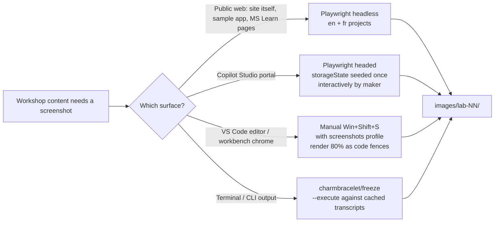

<!-- markdownlint-disable-file -->
# Task Research: Bilingual Copilot Studio Workshop Site (modeled on `agentic-accelerator-workshop`)

Convert the previously-researched "Hello World" Copilot Studio walkthrough (`.copilot-tracking/research/2026-05-25/copilot-studio-skill-hello-world-research.md`) into a **bilingual, published workshop website** structured and rendered like the sibling repo [`devopsabcs-engineering/agentic-accelerator-workshop`](https://github.com/devopsabcs-engineering/agentic-accelerator-workshop) (live at https://devopsabcs-engineering.github.io/agentic-accelerator-workshop/), with screenshots generated by a small, sharp three-tool harness (Playwright for web surfaces, headed-Playwright with seeded storage state for the Copilot Studio portal, `charmbracelet/freeze` for terminal stills, and manual snipping for VS Code chrome).

## Task Implementation Requests

* Adopt the sibling repo's stack 1:1: **Jekyll + `just-the-docs/just-the-docs` remote theme**, served from GitHub Pages via `actions/jekyll-build-pages@v1` (no Node toolchain for the docs build).
* Mirror the sibling's bilingual pattern: **parallel `fr/` directory tree**, per-page `lang: fr` + `nav_exclude: true` frontmatter, server-side Liquid sidebar override, manual markdown-link language switcher at the top of every homepage.
* Convert the hello-world content into a **flat 10-lab IA** (`lab-00`..`lab-09`) plus an "advanced" lab and reference pages, matching the sibling's zero-padded filename pattern.
* Wire a Playwright + `freeze` **screenshot harness** under `screenshots/` that emits to `images/lab-NN/lab-NN-<descriptor>.png` (sibling pattern), with the auth storage-state seed file gitignored.
* Publish via `.github/workflows/pages.yml` identical in shape to the sibling.
* No new technical content beyond what the hello-world research already covers.

## Scope and Success Criteria

* **In scope:** Jekyll site scaffold, `_config.yml`, `_includes/components/sidebar.html` (French nav override), `_includes/head_custom.html` (favicon + Mermaid CDN), 10 EN lab pages + 10 FR lab pages, 3 reference pages × 2 languages, `images/lab-NN/` screenshot folders, Playwright + `freeze` capture scripts, GitHub Actions Pages workflow.
* **Out of scope:** any NEW lab content beyond the hello-world walkthrough; translating the FR labs in this research doc (we ship the strategy + glossary, not the translation); sample companion app (the sibling has one — we do not); custom theme color palette / dark-mode toggle; analytics; custom domain.
* **Assumptions (all verified):**
  * The repo at `c:\src\GitHub\devopsabcs-engineering\copilot-studio-skill\` will host the site (currently empty besides `.copilot-tracking/`).
  * GitHub Pages source is set to **GitHub Actions** (not the legacy `gh-pages` branch).
  * The maintainer has a Microsoft 365 work/school account in a **demo tenant** (or accepts the redaction discipline below for screenshots from a working tenant).
  * MFA + conditional access apply to the Copilot Studio portal — accepted, handled via interactive storageState seed (never in CI).
  * The site's `baseurl` is `/copilot-studio-skill` (matching the sibling pattern).
* **Success Criteria:**
  * Visual + navigational parity with sibling site at `https://devopsabcs-engineering.github.io/agentic-accelerator-workshop/`.
  * Every lab page has an EN ↔ FR counterpart with reciprocal language-switcher link at the top.
  * 30 screenshots auto-/semi-generated via the documented three-tool harness; deterministic re-runs produce identical output.
  * A clean push to `main` builds + deploys to GitHub Pages with zero manual steps.

## Critical Context — Two Reconciliations the User Should Read First

1. **Language pair is EN ↔ FR, NOT EN ↔ ES.** The sibling repo's `fr/` directory and live language switcher (`🇫🇷 Version française` / `🇬🇧 English version`) confirm French, not Spanish. The org name `devopsabcs-engineering` is English ("DevOps ABCs Engineering"), not a Spanish-language signal. Recommendation: match the sibling exactly with **English + French**. If you prefer Spanish, the strategy carries over unchanged — only the glossary needs rebuilding against `learn.microsoft.com/es-es/...` (cost: ~2 hours of glossary rework, same file layout, same theme, same workflow).

2. **The sibling does NOT use Docusaurus / MkDocs / Astro.** It uses **Jekyll + `just-the-docs` remote theme** with no i18n plugin, no Node build, no `package.json` driving the docs. Translation is achieved purely via parallel filesystem + Liquid sidebar override. This is materially simpler than the typical "i18n SSG" stack and you should not over-engineer. The `sample-app/` Next.js application in the sibling is **excluded from the Jekyll build** via `_config.yml > exclude:`.

## Outline

1. Identify sibling SSG, theme, i18n mechanism, IA, screenshot conventions — **done** (Subagent D).
2. Map a three-surface screenshot harness with correct tool per surface — **done** (Subagent E).
3. Confirm the bilingual content strategy, glossary, partial-translation policy, tone — **done** (Subagent F).
4. Compose the 1:1 repo scaffold + Playwright/`freeze` harness + Actions workflow as the **selected approach**.
5. Record rejected alternatives with evidence.

## Potential Next Research

* Inspect `_includes/components/sidebar.html` of the sibling byte-for-byte to confirm there are no extra Liquid filters between `where` and `sort`.
  * Reasoning: the override sample we captured is mostly verbatim but ~30 lines deep; replicating perfectly avoids subtle sidebar-ordering bugs on day 1.
  * Reference: https://github.com/devopsabcs-engineering/agentic-accelerator-workshop/blob/main/_includes/components/sidebar.html
* Validate the exact Copilot Studio portal `data-testid` / ARIA labels listed in the redaction masks against live DevTools.
  * Reasoning: the masks documented in the Playwright doc are "likely; verify in DevTools" — first capture pass will surface any drift.
* Confirm the storageState cookie lifetime in the demo tenant (some tenants enforce 1-hour token lifetimes, which would force a reseed per run).
  * Reasoning: if the maker's demo tenant has aggressive conditional access, the workflow needs the seed step every screenshot session.
* Decide which labs actually need a VS Code workbench screenshot vs which can use a `code` fence (the "80% rule" from the Playwright research).
  * Reasoning: caps the manual screenshot inventory and gives `CONTRIBUTING.md` a clear policy.
* Identify the GitHub Pages **Settings → Pages → Source** value on the sibling repo (inferred to be "GitHub Actions" but not directly verified through public APIs).
  * Reasoning: required to match deploy behavior; one-line repo setting.

## Research Executed

### File Analysis

Local workspace was empty (besides `.copilot-tracking/`) at start of research. All analysis is of the sibling repo and external sources.

### External Research

* **Subagent D — Sibling repo deep-dive** ([sibling-workshop-repo-research.md](sibling-workshop-repo-research.md)): full directory tree to 3 levels, verbatim `_config.yml`/`Gemfile`/`pages.yml`/`fr/index.md` frontmatter, sidebar override pattern, image conventions, lab IA table for all 12 labs.
* **Subagent E — Playwright screenshot strategy** ([playwright-screenshot-strategy-research.md](playwright-screenshot-strategy-research.md)): surface map, Playwright config (multi-project EN/FR with storageState), MFA-and-conditional-access rationale, `freeze` install + `--execute` patterns, VS Code "don't automate" rationale + manual preflight, build-time npm scripts and PowerShell wrappers.
* **Subagent F — Bilingual content strategy** ([bilingual-content-strategy-research.md](bilingual-content-strategy-research.md)): language-pair correction (FR not ES), parallel file layout, glossary table (`topic` → `rubrique`, `tenant` → `tenant` kept, `skill` context-dependent), translation workflow recommendation (Azure AI Translator + glossary + human review), partial-translation policy, FR tone calibration with three side-by-side EN/FR paragraph examples.
* `fetch_webpage`: sibling repo + raw GitHub content + live GitHub Pages site + Microsoft Learn FR pages for glossary grounding + Playwright docs (`auth`, `screenshots`, `mask`) + `charmbracelet/freeze` README + `just-the-docs` theme docs.

### Project Conventions

* Conventions referenced: `.copilot-tracking/**` exempt from `.mega-linter.yml`; research doc disables markdownlint via top-of-file comment.
* Sibling-repo conventions adopted: zero-padded lab filenames (`lab-00`..`lab-09`); shared `images/` directory at root; kebab-case lab-prefixed screenshot names; per-page `lang: fr` + `nav_exclude: true` for FR; manual markdown-link language switcher.

## Key Discoveries

### Sibling Stack Identity (single most important finding)

| Item | Value |
|---|---|
| **SSG** | Jekyll (managed by `github-pages` gem; version pin tracks GitHub Pages whitelist) |
| **Theme** | [`just-the-docs/just-the-docs`](https://github.com/just-the-docs/just-the-docs) loaded via `remote_theme` (no version pin) |
| **Search** | `lunr`-based, default just-the-docs (`search_enabled` defaults to `true`) |
| **i18n** | None formal — manual parallel `fr/` tree + per-page `lang: fr` + Liquid sidebar override |
| **Build / deploy** | `.github/workflows/pages.yml` → `actions/jekyll-build-pages@v1` → `actions/deploy-pages@v4` |
| **Node toolchain in docs build?** | **No.** `Gemfile` is local-only; CI uses the pre-built Jekyll runtime in the action. |
| **Customizations** | `_includes/head_custom.html` (favicons + Mermaid CDN + title-wrap CSS), `_includes/components/sidebar.html` (FR nav override), `assets/branding/` (favicon + logo PNGs). **No** custom CSS, no `_sass/` override, no `color_scheme` change. |

### Bilingual Mechanism (zero-plugin design)

The sibling achieves bilingual with three artifacts and nothing else:

```text
fr/                                  # parallel filesystem tree
├── index.md                         # frontmatter: lang: fr, nav_exclude: true, permalink: /fr/
└── labs/lab-00-setup.md             # frontmatter: lang: fr, nav_exclude: true, permalink: /fr/labs/lab-00-setup
```

```liquid
{# _includes/components/sidebar.html — server-side branch on lang #}

  
  <nav>...hand-built FR nav from fr_pages...</nav>

  

```

```markdown
<!-- top of every EN homepage -->
> 🇫🇷 **[Version française](fr/)**

<!-- top of every FR homepage -->
> 🇬🇧 **[English version](../)**
```

Zero-padding (`lab-00`, not `lab-0`) is **load-bearing** — the FR sidebar sorts by permalink string; `lab-9` would sort after `lab-10` and break order.

### Three-Surface Screenshot Strategy (one tool per surface)



| Surface | Tool | Automatable | Auth |
|---|---|---|---|
| Workshop site, deployed sample, Microsoft Learn pages | Playwright headless (en + fr projects) | Fully | None |
| Copilot Studio portal | Playwright headed + `storageState` reuse | Partial (after one interactive seed) | Entra ID + MFA |
| VS Code editor + integrated terminal | Manual `Win+Shift+S` of a curated screenshots profile | No | None |
| Pure terminal output (PowerShell, `copilot`, `freeze --execute`) | `charmbracelet/freeze` from committed `.txt` transcripts | Fully | None |

**Key constraints:**
* Copilot Studio portal MFA + conditional access **cannot be safely automated** in CI; storage state file must live in `screenshots/.auth/` and be **gitignored**.
* Screenshots are **pre-committed**, not regenerated on every CI build. Regenerate locally on demand via the documented npm/PowerShell scripts.

### Lab Information Architecture (10 labs + reference)

Mapped from the hello-world walkthrough into the sibling's flat-labs rhythm:

| File | Title (EN) | Time | Level | # Screenshots |
|---|---|---|---|---|
| `labs/lab-00-prerequisites.md` | Prerequisites | 15 min | Beginner | 3 |
| `labs/lab-01-install-windows-tooling.md` | Install Windows tooling | 15 min | Beginner | 3 |
| `labs/lab-02-install-copilot-studio-extension.md` | Install the Copilot Studio VS Code Extension | 5 min | Beginner | 2 |
| `labs/lab-03-create-blank-agent.md` | Create your first blank agent in the portal | 10 min | Beginner | 3 |
| `labs/lab-04-setup-workspace-and-cli.md` | Set up local workspace and launch Copilot CLI | 10 min | Beginner | 2 |
| `labs/lab-05-install-skills-plugin.md` | Install the `skills-for-copilot-studio` plugin | 5 min | Beginner | 2 |
| `labs/lab-06-clone-agent.md` | Clone the agent into your workspace | 10 min | Beginner | 4 |
| `labs/lab-07-author-hello-world-topic.md` | Author the Hello World topic | 10 min | Beginner | 2 |
| `labs/lab-08-push-and-publish.md` | Push and publish | 10 min | Beginner | 3 |
| `labs/lab-09-test-in-portal.md` | Test in the portal | 5 min | Beginner | 3 |
| `labs/lab-10-advanced-add-knowledge-source.md` | (Advanced) Add a knowledge source | 15 min | Intermediate | 3 |
| `labs/troubleshooting.md` | Troubleshooting reference | n/a | n/a | 0 |
| `labs/glossary.md` | Glossary | n/a | n/a | 0 |
| `labs/references.md` | References | n/a | n/a | 0 |

Total ~110 minutes, 30 screenshots. Each EN file has a `fr/labs/<same-filename>.md` counterpart (filename stays English; title inside is French).

### Glossary Highlights (EN ↔ FR — Microsoft-aligned)

Full glossary lives in [bilingual-content-strategy-research.md](subagents/2026-05-25/bilingual-content-strategy-research.md). The three terms most likely to cause confusion if mistranslated:

| EN | FR | Note |
|---|---|---|
| `topic` | **`rubrique`** (not `sujet`) | MS Learn FR ships both; canonical title is "Créer et modifier des rubriques". Workshop must standardize. |
| `tenant` | **`tenant`** (kept English) | MS 365 admin docs use `locataire`; Entra/dev docs keep `tenant`. Workshop screenshots show dev UI → keep `tenant`. |
| `skill` (plugin / SKILL.md file) | **`skill`** (kept) — but `compétence` for the Copilot Studio Bot Framework "Skill" | Three meanings live at once. See sibling repo for live precedent of mixed usage. |

Other anchors: `Copilot Studio` (never translated), `compte professionnel ou scolaire`, `dépôt`, `espace de travail`, `plug-in` (hyphenated, Microsoft Style), `source de connaissances`, `volet de test`, `publier` / `tester` (verb forms), French typographic NBSP before `:`, French guillemets `« »` for direct quotes.

### Configuration Examples

#### Minimal `_config.yml` (mirror sibling)

```yaml
title: "Copilot Studio Skill Workshop"
description: "Build, push, and publish a Copilot Studio agent from VS Code using GitHub Copilot CLI."
remote_theme: just-the-docs/just-the-docs
baseurl: "/copilot-studio-skill"
url: "https://devopsabcs-engineering.github.io"
search_enabled: true
heading_anchors: true

defaults:
  - scope: { path: "" }
    values: { layout: "default" }
  - scope: { path: "images" }
    values: { nav_exclude: true }

exclude:
  - Gemfile
  - Gemfile.lock
  - README.md
  - .copilot-tracking
  - screenshots
  - node_modules
  - package.json
  - package-lock.json
```

#### `_includes/components/sidebar.html` (FR nav override — adopt sibling verbatim)

```liquid

  
  <nav role="navigation" aria-label="Navigation principale (français)" class="site-nav">
    <ul class="nav-list">
      
        <li class="nav-list-item">
          <a href="{{ p.url | relative_url }}" class="nav-list-link active">
            {{ p.title }}
          </a>
        </li>
      
    </ul>
  </nav>

  

```

#### `_includes/head_custom.html` (favicon + Mermaid + title-wrap)

```html
<link rel="icon" href="{{ '/assets/branding/favicon.ico' | relative_url }}" />
<link rel="icon" type="image/png" sizes="32x32" href="{{ '/assets/branding/favicon-32x32.png' | relative_url }}" />
<link rel="apple-touch-icon" href="{{ '/assets/branding/apple-touch-icon.png' | relative_url }}" />

<script type="module">
  import mermaid from 'https://cdn.jsdelivr.net/npm/mermaid@11/dist/mermaid.esm.min.mjs';
  // Transform fenced ```mermaid blocks into <div class="mermaid"> nodes
  document.querySelectorAll('pre > code.language-mermaid').forEach((el) => {
    const div = document.createElement('div');
    div.className = 'mermaid';
    div.textContent = el.textContent;
    el.parentElement.replaceWith(div);
  });
  mermaid.initialize({ startOnLoad: true, theme: 'default' });
</script>

<style>
  .site-title { white-space: normal; }
</style>
```

#### `.github/workflows/pages.yml` (GitHub Pages deploy)

```yaml
name: Deploy Jekyll site to Pages

on:
  push:
    branches: [main]
  workflow_dispatch:

permissions:
  contents: read
  pages: write
  id-token: write

concurrency:
  group: pages
  cancel-in-progress: false

jobs:
  build:
    runs-on: ubuntu-latest
    steps:
      - uses: actions/checkout@v4
      - uses: actions/configure-pages@v5
      - uses: actions/jekyll-build-pages@v1
        with:
          source: ./
          destination: ./_site
      - uses: actions/upload-pages-artifact@v3

  deploy:
    needs: build
    runs-on: ubuntu-latest
    environment:
      name: github-pages
      url: ${{ steps.deployment.outputs.page_url }}
    steps:
      - id: deployment
        uses: actions/deploy-pages@v4
```

Settings → Pages → **Source: GitHub Actions** (one-time, manual).

#### `playwright.config.ts` (multi-project EN/FR)

```ts
import { defineConfig, devices } from '@playwright/test';

export default defineConfig({
  testDir: 'screenshots/playwright',
  fullyParallel: false,
  workers: 1,
  reporter: [['list']],
  use: {
    viewport: { width: 1440, height: 900 },
    deviceScaleFactor: 2,
    colorScheme: 'light',
    timezoneId: 'America/Los_Angeles',
    actionTimeout: 15_000,
    navigationTimeout: 30_000,
    screenshot: 'off',
    trace: 'off',
  },
  projects: [
    { name: 'seed-copilotstudio', testMatch: /seed\.copilotstudio\.ts/, grep: /@seed/ },
    {
      name: 'en-public',
      use: { ...devices['Desktop Chrome'], locale: 'en-US', extraHTTPHeaders: { 'Accept-Language': 'en-US,en;q=0.9' } },
      testMatch: /public\..*\.ts/,
    },
    {
      name: 'fr-public',
      use: { ...devices['Desktop Chrome'], locale: 'fr-FR', extraHTTPHeaders: { 'Accept-Language': 'fr-FR,fr;q=0.9' } },
      testMatch: /public\..*\.ts/,
    },
    {
      name: 'en-copilotstudio',
      use: {
        ...devices['Desktop Chrome'], locale: 'en-US',
        extraHTTPHeaders: { 'Accept-Language': 'en-US,en;q=0.9' },
        storageState: 'screenshots/.auth/copilotstudio.json',
      },
      testMatch: /copilotstudio\..*\.ts/,
    },
    {
      name: 'fr-copilotstudio',
      use: {
        ...devices['Desktop Chrome'], locale: 'fr-FR',
        extraHTTPHeaders: { 'Accept-Language': 'fr-FR,fr;q=0.9' },
        storageState: 'screenshots/.auth/copilotstudio.json',
      },
      testMatch: /copilotstudio\..*\.ts/,
    },
  ],
});
```

#### `freeze` invocation (terminal still from cached transcript)

```powershell
# Install once: winget install charmbracelet.freeze  (or: go install github.com/charmbracelet/freeze@latest)

# Render a transcript to a PNG
freeze .\screenshots\transcripts\lab-05-plugin-install.txt `
  --theme dracula `
  --window --border.radius 8 --shadow.blur 20 --shadow.y 10 `
  --padding 20,40 --font.family "Cascadia Code" --font.size 14 `
  --output .\images\lab-05\lab-05-plugin-install.png

# Or live capture (use sparingly — output may drift)
freeze --execute "copilot --version" --output .\images\lab-01\lab-01-copilot-version.png
```

## Technical Scenarios

### Selected Approach — Jekyll + just-the-docs sibling-parity site with three-tool screenshot harness

**Description.** Build a Jekyll site in the repo root that mirrors the sibling 1:1: parallel `fr/` tree, server-side Liquid sidebar override, manual markdown-link language switcher, zero-padded lab filenames, shared `images/lab-NN/` screenshot folders. Generate screenshots with a three-tool harness driven from `screenshots/` (Playwright multi-project for web + portal, `freeze` for terminal stills, manual snipping for VS Code chrome). Publish via `.github/workflows/pages.yml` using `actions/jekyll-build-pages@v1`.

**Requirements:**

* Maintainer has Ruby installed only if local `bundle exec jekyll serve` preview is desired; CI does not need it.
* Maintainer has Node 22+ (for Playwright), Go or `winget` (for `freeze`), and a demo M365 tenant (for portal screenshots).
* Maintainer accepts the **all-or-nothing FR translation policy**: never merge a new EN lab without its FR counterpart in the same PR.

**Preferred approach because:**

1. Matches the sibling visually, navigationally, and operationally — a contributor who knows the sibling can contribute here on day 1.
2. Zero-plugin i18n avoids the maintenance pit of Jekyll i18n plugins (which are unmaintained or buggy).
3. Three-tool screenshot strategy honors each surface's actual automation ceiling — no fighting Electron, no fighting MFA in CI.
4. Pre-committed screenshots make every site deploy deterministic and CI-only (no Playwright in the publish path).

**File tree changes (new files created in the repo):**

```text
copilot-studio-skill/
├── .github/
│   └── workflows/
│       └── pages.yml                              # GitHub Pages deploy
├── .gitignore                                     # screenshots/.auth/, screenshots/raw/, screenshots/final/, node_modules/
├── _config.yml                                    # Jekyll + just-the-docs
├── _includes/
│   ├── components/
│   │   └── sidebar.html                           # FR nav override
│   └── head_custom.html                           # favicons + Mermaid CDN + title-wrap CSS
├── assets/
│   └── branding/
│       ├── favicon.ico
│       ├── favicon-32x32.png
│       ├── apple-touch-icon.png
│       └── logo-128.png
├── Gemfile                                        # local serve only
├── LICENSE                                        # MIT (copy sibling)
├── README.md                                      # nav_exclude: true
├── CODE_OF_CONDUCT.md                             # copy sibling pattern
├── CONTRIBUTING.md                                # documents the screenshot harness + translation policy
├── index.md                                       # EN homepage: hero, lab table, schedule, FR link at top
├── labs/                                          # EN labs
│   ├── lab-00-prerequisites.md
│   ├── lab-01-install-windows-tooling.md
│   ├── lab-02-install-copilot-studio-extension.md
│   ├── lab-03-create-blank-agent.md
│   ├── lab-04-setup-workspace-and-cli.md
│   ├── lab-05-install-skills-plugin.md
│   ├── lab-06-clone-agent.md
│   ├── lab-07-author-hello-world-topic.md
│   ├── lab-08-push-and-publish.md
│   ├── lab-09-test-in-portal.md
│   ├── lab-10-advanced-add-knowledge-source.md
│   ├── troubleshooting.md
│   ├── glossary.md
│   └── references.md
├── fr/                                            # FR locale tree
│   ├── index.md                                   # lang: fr, permalink: /fr/, nav_exclude: true
│   └── labs/                                      # one file per EN lab, English filename, FR title inside
│       └── lab-00-prerequisites.md
│       └── ... (10 lab files + 3 reference files)
├── images/                                        # shared between EN and FR
│   ├── lab-00/
│   │   ├── lab-00-copilot-subscription.png
│   │   ├── lab-00-trial-signup.png
│   │   └── lab-00-env-switcher.png
│   ├── lab-01/ ... lab-10/                        # per-lab subfolders
│   ├── architecture-diagram.png                   # rendered from architecture-diagram.mmd
│   └── architecture-diagram.mmd                   # mermaid source
├── package.json                                   # devDeps: @playwright/test; scripts: screenshots:*
├── playwright.config.ts                           # at root (or screenshots/playwright/)
└── screenshots/                                   # excluded from Jekyll build
    ├── .auth/                                     # GITIGNORED — storage state for Copilot Studio
    ├── raw/                                       # GITIGNORED — pre-mask intermediates
    ├── final/                                     # GITIGNORED — generated PNGs before promote.ps1 copies into images/
    ├── transcripts/                               # COMMITTED — text fixtures for freeze, PII scrubbed
    │   ├── lab-01-pwsh-version.txt
    │   ├── lab-01-copilot-version.txt
    │   ├── lab-05-plugin-install.txt
    │   └── ...
    ├── playwright/
    │   ├── seed.copilotstudio.ts
    │   ├── public.workshop-site.ts
    │   ├── public.ms-learn.ts
    │   └── copilotstudio.create-agent.ts
    │   └── copilotstudio.test-pane.ts
    └── scripts/
        ├── capture-terminal.ps1                   # loop transcripts/ → freeze → images/lab-NN/
        ├── capture-web.ps1                        # npx playwright test --project=en-public --project=fr-public
        ├── capture-portal.ps1                     # npx playwright test --project=en-copilotstudio --project=fr-copilotstudio
        └── promote.ps1                            # final/ → images/lab-NN/
```

**Implementation Details.**

1. **Scaffold step order.**
   1. Copy `LICENSE`, `CODE_OF_CONDUCT.md` from sibling verbatim (MIT + Microsoft OSS CoC). Author a CONTRIBUTING.md tailored to this workshop (translation policy, screenshot harness).
   2. Write `_config.yml` + `Gemfile` + `_includes/head_custom.html` + `_includes/components/sidebar.html` from the snippets above.
   3. Author `index.md` (EN homepage) mirroring sibling shape: H1, FR-link blockquote, centered logo, intro, lab table, time-estimate badge.
   4. Stub all 10 EN lab files with frontmatter + a placeholder body. Each lab uses the structure: Time/Level mini-table → Overview → Learning objectives → Exercises (numbered) → Verification Checkpoint → Next Steps.
   5. Stub `fr/index.md` and `fr/labs/*.md` mirrors with `lang: fr`, `permalink: /fr/...`, EN-link blockquote at top.
   6. Add `.github/workflows/pages.yml`.
   7. Set Settings → Pages → Source = **GitHub Actions** (manual repo setting; document in CONTRIBUTING).

2. **Lab page template (EN).**

   ```markdown
   ---
   title: "Lab 07 — Author the Hello World topic"
   description: Use @copilot-studio:copilot-studio-author to add a YAML topic that replies "Hello, world!".
   permalink: /labs/lab-07-author-hello-world-topic
   ---

   > 🇫🇷 **[Version française](/copilot-studio-skill/fr/labs/lab-07-author-hello-world-topic)**

   # Lab 07 — Author the Hello World topic

   | Duration | Level | Prerequisites |
   |---|---|---|
   | 10 min | Beginner | Lab 06 complete (agent cloned) |

   ## Overview
   ...

   ## Learning objectives
   ...

   ## Exercise 7.1 — Create the topic

   1. In the `copilot` session opened at the end of Lab 06, run:

      ```text
      @copilot-studio:copilot-studio-author Create a new topic ...
      ```

   

   2. ...

   ## Verification Checkpoint

   Before proceeding, verify:

   * [ ] `topics/HelloWorld.topic.mcs.yml` exists in your workspace.
   * [ ] The file contains an `OnRecognizedIntent` trigger with `hello` in `triggerQueries`.

   ## Next Steps

   Proceed to [Lab 08 — Push and publish](lab-08-push-and-publish.md).
   ```

3. **Lab page template (FR — parity).** Same structure; bilingually-rewritten body per the glossary; FR title; `lang: fr`; reciprocal language-switcher link at the top.

4. **Screenshot harness wiring.**
   * Add `package.json` with `devDependencies: { "@playwright/test": "^1.49.0" }` and `scripts`:

     ```jsonc
     {
       "scripts": {
         "screenshots:seed":     "playwright test --project=seed-copilotstudio --headed",
         "screenshots:web":      "playwright test --project=en-public --project=fr-public",
         "screenshots:portal":   "playwright test --project=en-copilotstudio --project=fr-copilotstudio",
         "screenshots:terminal": "pwsh screenshots/scripts/capture-terminal.ps1",
         "screenshots:promote":  "pwsh screenshots/scripts/promote.ps1",
         "screenshots":          "npm run screenshots:web && npm run screenshots:portal && npm run screenshots:terminal && npm run screenshots:promote"
       }
     }
     ```

   * Add `.gitignore` entries: `screenshots/.auth/`, `screenshots/raw/`, `screenshots/final/`, `node_modules/`.
   * Install `freeze` via `winget install charmbracelet.freeze`. Document in CONTRIBUTING.

5. **Bilingual screenshot decision per lab.**
   * **EN-only screenshots (shared with FR), with a French-locale callout in FR prose:** Labs 01, 02, 04, 05, 07, 08 (VS Code + CLI + git + PowerShell — these surfaces are English-only on Windows by default).
   * **EN + FR parallel screenshots:** Labs 03, 06, 09, 10 (Copilot Studio portal — switch portal language via top-right profile, recapture with Playwright `fr-copilotstudio` project).
   * Document the decision in `CONTRIBUTING.md` so contributors know when to capture twice.

6. **Translation workflow.** Use **Azure AI Translator with a custom glossary** seeded from the glossary table in [bilingual-content-strategy-research.md](subagents/2026-05-25/bilingual-content-strategy-research.md). Author EN first, machine-translate to FR, human-review each FR page before merging. Budget ~10 min/page review, ~2.5 hours total.

7. **Partial-translation policy.** Hard rule: every PR that adds or modifies an EN lab MUST add/modify the FR counterpart in the same PR. Document in CONTRIBUTING. If a stale FR page is ever shipped, add a single-line banner at the top:

   > 🇬🇧 *Cette page peut être en retard sur la [version anglaise](...). Dernière mise à jour FR : YYYY-MM-DD.*

8. **Local dev preview.**

   ```powershell
   # one-time
   gem install bundler jekyll
   bundle install

   # preview
   bundle exec jekyll serve --livereload --baseurl ""
   ```

   (Note: `--baseurl ""` overrides `_config.yml`'s `/copilot-studio-skill` so local previews work at `http://localhost:4000/`.)

## Alternatives Considered

### A. Docusaurus (TypeScript / Node) with first-class i18n — Rejected

**Why considered:** Docusaurus is the highest-traction modern docs SSG with `i18n` blocks in `docusaurus.config.js`, automatic locale routing, translation-string extraction, dark mode, search via Algolia, copy-button code blocks. Visually slicker than just-the-docs out of the box.

**Why rejected:** Diverges from sibling. Different stack (Node toolchain in publish path) means contributors who know the sibling cannot trivially contribute here. The user's request is explicitly **"like sibling repo"** — adopting the sibling's stack 1:1 is the strongest interpretation. Docusaurus also imposes a larger learning curve on a single-maintainer workshop.

### B. MkDocs Material with `i18n` plugin — Rejected

**Why considered:** Python toolchain (lighter than Node for Microsoft-aligned Azure folks); first-class i18n plugin; great default theme.

**Why rejected:** Same reason as A — diverges from sibling. Also: Python virtualenv setup is friction for contributors on Windows.

### C. Jekyll + `jekyll-multiple-languages-plugin` (real i18n plugin) — Rejected

**Why considered:** Stays on the sibling's Jekyll runtime AND adds first-class i18n with `_i18n/` translation strings, automatic locale routing, language detection.

**Why rejected:** Sibling explicitly does NOT use it. Replicating sibling means **manual parallel directory + sidebar override**, period. Plugin would also add a `_config.yml > plugins:` entry that breaks compatibility with `actions/jekyll-build-pages@v1`'s allowlist (the action only ships pre-approved plugins).

### D. Playwright Electron driving VS Code Stable — Rejected for screenshots

**Why considered:** Would let you fully automate VS Code workbench screenshots.

**Why rejected:** Playwright's `_electron` driver against shipping VS Code Stable on Windows is brittle (code signing + Fuses + workbench DOM instability across point releases). Recommended path is manual snipping of a curated screenshots profile + rendering ~80% of "editor screenshots" as plain code fences in the SSG.

### E. Service-account M365 user with MFA disabled for headless portal screenshots — Rejected

**Why considered:** Would let CI capture Copilot Studio portal screenshots without human-in-the-loop.

**Why rejected:** Explicitly against Microsoft security guidance for any account touching production data. Tenant admins typically prohibit MFA-exempt service accounts in any tenant that holds real customer data. Storage-state reuse pattern (interactive seed, headless reuse until cookies expire) is the official Playwright pattern and the only one that survives conditional access.

### F. `carbon-now-cli` or `silicon` for terminal stills — Rejected

**Why considered:** Both produce attractive terminal stills.

**Why rejected:** `carbon-now-cli` drives Playwright against carbon.now.sh — adds a network dependency and a second hidden browser install for the same job. `silicon` is PNG-only, no SVG, and on Windows the harfbuzz feature flag is fiddly. `freeze` matches both on output quality, ships Windows binaries, supports SVG with embedded fonts, and has no browser dependency.

### G. `asciinema + agg` for animated terminal GIFs — Acceptable for specific cases

**Why considered:** Animated typing/output captures are pedagogically valuable for autocomplete demos and TUI walkthroughs.

**Why not the primary tool:** Static `freeze` PNGs are faster to load, easier to translate (alt text), and easier to maintain. Reserve `asciinema + agg` for the rare lab where seeing-the-typing genuinely matters (e.g., a future lab that demos `@copilot-studio:copilot-studio-author` streaming a long YAML response).

### H. Reuse all sibling-repo screenshots across EN+FR with no parallel FR capture — Acceptable shortcut

**Why considered:** Sibling does this (`images/` at root, no `fr/images/`). Minimal capture work.

**Why partially adopted:** For VS Code + CLI + PowerShell + git surfaces (which are English-only on Windows by default), share images across locales — cheapest and most authentic. For Copilot Studio portal screenshots specifically, capture in **both** EN and FR because the portal genuinely localizes. This is the only place where Option H is **rejected in favor of parallel capture**.

## References (Primary Sources)

* Sibling repo + live site:
  * [`devopsabcs-engineering/agentic-accelerator-workshop`](https://github.com/devopsabcs-engineering/agentic-accelerator-workshop)
  * [Live site](https://devopsabcs-engineering.github.io/agentic-accelerator-workshop/)
  * [`_config.yml`](https://github.com/devopsabcs-engineering/agentic-accelerator-workshop/blob/main/_config.yml)
  * [`fr/index.md`](https://github.com/devopsabcs-engineering/agentic-accelerator-workshop/blob/main/fr/index.md)
* SSG / theme:
  * [Jekyll](https://jekyllrb.com/)
  * [`just-the-docs/just-the-docs`](https://github.com/just-the-docs/just-the-docs)
  * [`actions/jekyll-build-pages`](https://github.com/actions/jekyll-build-pages)
* Screenshot tooling:
  * [Playwright — Intro](https://playwright.dev/docs/intro)
  * [Playwright — Screenshots](https://playwright.dev/docs/screenshots)
  * [Playwright — Authentication](https://playwright.dev/docs/auth)
  * [Playwright — Electron (not recommended here)](https://playwright.dev/docs/api/class-electron)
  * [`charmbracelet/freeze`](https://github.com/charmbracelet/freeze)
  * [`asciinema/agg`](https://github.com/asciinema/agg) (animated GIF fallback)
* Copilot Studio product (FR locale verified):
  * [Microsoft Copilot Studio (FR)](https://learn.microsoft.com/fr-fr/microsoft-copilot-studio/)
  * [Créer et modifier des rubriques (FR)](https://learn.microsoft.com/fr-fr/microsoft-copilot-studio/authoring-create-edit-topics)
  * [Prise en charge des langues (FR)](https://learn.microsoft.com/fr-fr/microsoft-copilot-studio/authoring-language-support)
* Subagent research documents (this session):
  * `.copilot-tracking/research/subagents/2026-05-25/sibling-workshop-repo-research.md`
  * `.copilot-tracking/research/subagents/2026-05-25/playwright-screenshot-strategy-research.md`
  * `.copilot-tracking/research/subagents/2026-05-25/bilingual-content-strategy-research.md`
* Adjacent research (this session):
  * `.copilot-tracking/research/2026-05-25/copilot-studio-skill-hello-world-research.md` (source content for all 10 labs)
