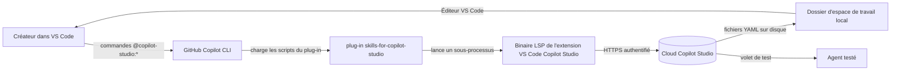

> 🇬🇧 **[English version](../)**

  

## Vue d'ensemble

Amenez un débutant d'un espace de travail VS Code vide sous Windows jusqu'à un agent Microsoft Copilot Studio fonctionnel. Vous rédigez l'agent localement en YAML à l'aide du plug-in [`microsoft/skills-for-copilot-studio`](https://github.com/microsoft/skills-for-copilot-studio) exécuté dans GitHub Copilot CLI, vous le poussez vers le cloud Copilot Studio, vous le publiez depuis le portail, puis vous le testez. L'atelier se termine par un lab avancé qui ajoute une source de connaissances publique au même agent.

## Architecture de l'information des labs

| Lab | Titre | Durée | Niveau |
|---|---|---|---|
| 00 | [Prérequis](labs/lab-00-prerequisites.md) | 15 min | Débutant |
| 01 | [Installer l'outillage Windows](labs/lab-01-install-windows-tooling.md) | 15 min | Débutant |
| 02 | [Installer l'extension VS Code Copilot Studio](labs/lab-02-install-copilot-studio-extension.md) | 5 min | Débutant |
| 03 | [Créer votre premier agent vide dans le portail](labs/lab-03-create-blank-agent.md) | 10 min | Débutant |
| 04 | [Préparer l'espace de travail local et lancer Copilot CLI](labs/lab-04-setup-workspace-and-cli.md) | 10 min | Débutant |
| 05 | [Installer le plug-in `skills-for-copilot-studio`](labs/lab-05-install-skills-plugin.md) | 5 min | Débutant |
| 06 | [Cloner l'agent dans votre espace de travail](labs/lab-06-clone-agent.md) | 10 min | Débutant |
| 07 | [Rédiger la rubrique Hello World](labs/lab-07-author-hello-world-topic.md) | 10 min | Débutant |
| 08 | [Pousser et publier](labs/lab-08-push-and-publish.md) | 10 min | Débutant |
| 09 | [Tester dans le portail](labs/lab-09-test-in-portal.md) | 5 min | Débutant |
| 10 | [(Avancé) Ajouter une source de connaissances](labs/lab-10-advanced-add-knowledge-source.md) | 15 min | Intermédiaire (facultatif) |
| Réf | [Dépannage](labs/troubleshooting.md) | s. o. | s. o. |
| Réf | [Glossaire](labs/glossary.md) | s. o. | s. o. |
| Réf | [Références](labs/references.md) | s. o. | s. o. |

## Architecture

## Ce que vous allez construire

* Un agent Copilot Studio vide nommé `HelloWorldAgent` cloné dans un espace de travail VS Code local.
* Un fichier `topics/HelloWorld.topic.mcs.yml` qui se déclenche sur « hello » et répond par une salutation.
* Le même agent republié avec une source de connaissances publique Microsoft Learn attachée.

## Outillage en bref

* GitHub Copilot CLI (`copilot`) exécuté dans le terminal intégré de VS Code.
* Le plug-in `microsoft/skills-for-copilot-studio`, qui fournit quatre sous-agents `@copilot-studio:*`.
* L'extension VS Code Copilot Studio, qui livre le binaire `LanguageServerHost` utilisé pour la synchronisation cloud.

## Pour commencer

Démarrez au [Lab 00 — Prérequis](labs/lab-00-prerequisites.md).
