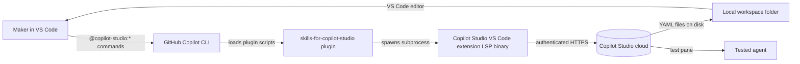

> 🇫🇷 **[Version française](fr/)**

  

## Overview

Take a beginner from an empty VS Code workspace on Windows to a working Microsoft Copilot Studio agent. You author the agent locally as YAML using the [`microsoft/skills-for-copilot-studio`](https://github.com/microsoft/skills-for-copilot-studio) plugin running inside GitHub Copilot CLI, push it to the Copilot Studio cloud, publish it from the portal, and test it. The workshop ends with one advanced lab that adds a public knowledge source to the same agent.

## Lab information architecture

| Lab | Title | Time | Level |
|---|---|---|---|
| 00 | [Prerequisites](labs/lab-00-prerequisites.md) | 15 min | Beginner |
| 01 | [Install Windows tooling](labs/lab-01-install-windows-tooling.md) | 15 min | Beginner |
| 02 | [Install the Copilot Studio VS Code extension](labs/lab-02-install-copilot-studio-extension.md) | 5 min | Beginner |
| 03 | [Create your first blank agent in the portal](labs/lab-03-create-blank-agent.md) | 10 min | Beginner |
| 04 | [Set up local workspace and launch Copilot CLI](labs/lab-04-setup-workspace-and-cli.md) | 10 min | Beginner |
| 05 | [Install the `skills-for-copilot-studio` plugin](labs/lab-05-install-skills-plugin.md) | 5 min | Beginner |
| 06 | [Clone the agent into your workspace](labs/lab-06-clone-agent.md) | 10 min | Beginner |
| 07 | [Author the Hello World topic](labs/lab-07-author-hello-world-topic.md) | 10 min | Beginner |
| 08 | [Push and publish](labs/lab-08-push-and-publish.md) | 10 min | Beginner |
| 09 | [Test in the portal](labs/lab-09-test-in-portal.md) | 5 min | Beginner |
| 10 | [(Advanced) Add a knowledge source](labs/lab-10-advanced-add-knowledge-source.md) | 15 min | Intermediate (optional) |
| Ref | [Troubleshooting](labs/troubleshooting.md) | n/a | n/a |
| Ref | [Glossary](labs/glossary.md) | n/a | n/a |
| Ref | [References](labs/references.md) | n/a | n/a |

## Architecture

## What you will build

* A blank Copilot Studio agent named `HelloWorldAgent` cloned into a local VS Code workspace.
* A `topics/HelloWorld.topic.mcs.yml` file that triggers on "hello" and replies with a greeting.
* The same agent re-published with a public Microsoft Learn knowledge source attached.

## Tooling at a glance

* GitHub Copilot CLI (`copilot`) running in the VS Code integrated terminal.
* The `microsoft/skills-for-copilot-studio` plugin, providing four `@copilot-studio:*` sub-agents.
* The Copilot Studio VS Code extension, which ships the `LanguageServerHost` binary used for cloud sync.

## Get started

Start at [Lab 00 — Prerequisites](labs/lab-00-prerequisites.md).
